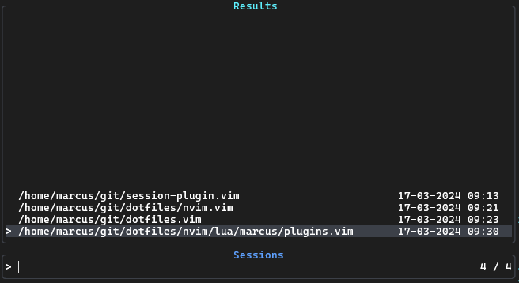

# SeshMgr.nvim

<div align="center">

SeshMgr.nvim is a session management plugin for Neovim to save and load sessions.



[](https://github.com/mackeper/SeshMgr.nvim/actions/workflows/docs.yml)
[](https://github.com/mackeper/SeshMgr.nvim/actions/workflows/tests.yml)

[Introduction](#introduction-wave) •
[Features](#features-sparkles) •
[Installation](#installation-package) •
[Configuration](#configuration-gear) •
[Contributing](#contributing-tada) •
[Related Projects](#related-projects-link)

</div>

# Introduction :wave:

I made this plugin for myself, there are many other plugins that do the same thing, see [related projects](#related-projects-link).
The main difference is that this plugin is that the telescope integration lists session with timestamps and in order of last used.

# Features :sparkles:

Manually save and load sessions using [commands](#commands-keyboard) or use [telescope](#telescope-telescope) to manage sessions.
By default, autosave is enabled to save the session when exiting Neovim. This can be disabled in the [configuration](#configuration-wrench).

## Commands :keyboard:

| Command | Description |
:-------------------------|:-------------------------
`:SessionSave` | Save the current session by current working directory (cwd).
`:SessionLoad {session_full_path}` | Load the given session path.
`:SessionLoadLast` | Load the last session.
`:SessionDelete {session_full_path}` | Delete the given session.
`:SessionDeleteCurrent` | Delete the file associated with the current session.
`:SessionList` | List all session files.

## Telescope :telescope:

You can delete and load sessions using telescope.

- `<leader>js` to open telescope ([configurable](#configuration-wrench))
- `<CR>` to load session.
- `<C-d>` to delete session.

# Installation :package:

<details>
<summary>With <a href="https://github.com/folke/lazy.nvim">folke/lazy.nvim</a></summary>

```lua
{
    "mackeper/seshmgr.nvim",
    event = "VeryLazy",
    opts = {},

    -- optional keymappings
    keys = {
        { "<leader>sl", "<CMD>SessionLoadLast<CR>", desc = "Load last session" },
        { "<leader>sL", "<CMD>SessionList<CR>", desc = "List sessions" },
        { "<leader>ss", "<CMD>SessionSave<CR>", desc = "Save session" },
    },
}

```

You need to either have the `opts` table or call the `setup({})` function in your config.

</details>

# Configuration :gear:

To configure the plugin, pass a table to the setup function or in the case of lazy the opts table.

<details>
<summary>Example</summary>

```lua
require("seshmgr").setup({
    session_dir = vim.fn.stdpath("data") .. "/my_sessions",

    autosave = false,

    telescope = {
        enabled = false,
    },
})
```

</details>

### Default configuration

```lua
{
    session_dir = vim.fn.stdpath("data") .. "/sessions",
    session_name_delimiter = "!",

    autosave_events = { "ExitPre" },
    autosave = true,

    telescope = {
        enabled = true,
        keymap = "<leader>js",
    },
}
```

# Contributing :tada:

See [CONTRIBUTING.md](./CONTRIBUTING.md)

# Related Projects :link:

- [rmagatti/auto-session](https://github.com/rmagatti/auto-session)
- [echasnovski/mini.nvim#mini.sessions](https://github.com/echasnovski/mini.nvim#mini.sessions)
- [gennaro-tedesco/nvim-possession](https://github.com/gennaro-tedesco/nvim-possession)
- [olimorris/persisted.nvim](https://github.com/olimorris/persisted.nvim)
- [Shatur/neovim-session-manager](https://github.com/Shatur/neovim-session-manager)
- [jedrzejboczar/possession.nvim](https://github.com/jedrzejboczar/possession.nvim)
- [niuiic/multiple-session.nvim](https://github.com/niuiic/multiple-session.nvim)
- [RutaTang/spectacle.nvim](https://github.com/RutaTang/spectacle.nvim)
- [coffebar/neovim-project](https://github.com/coffebar/neovim-project)
- [natecraddock/sessions.nvim](https://github.com/natecraddock/sessions.nvim)
